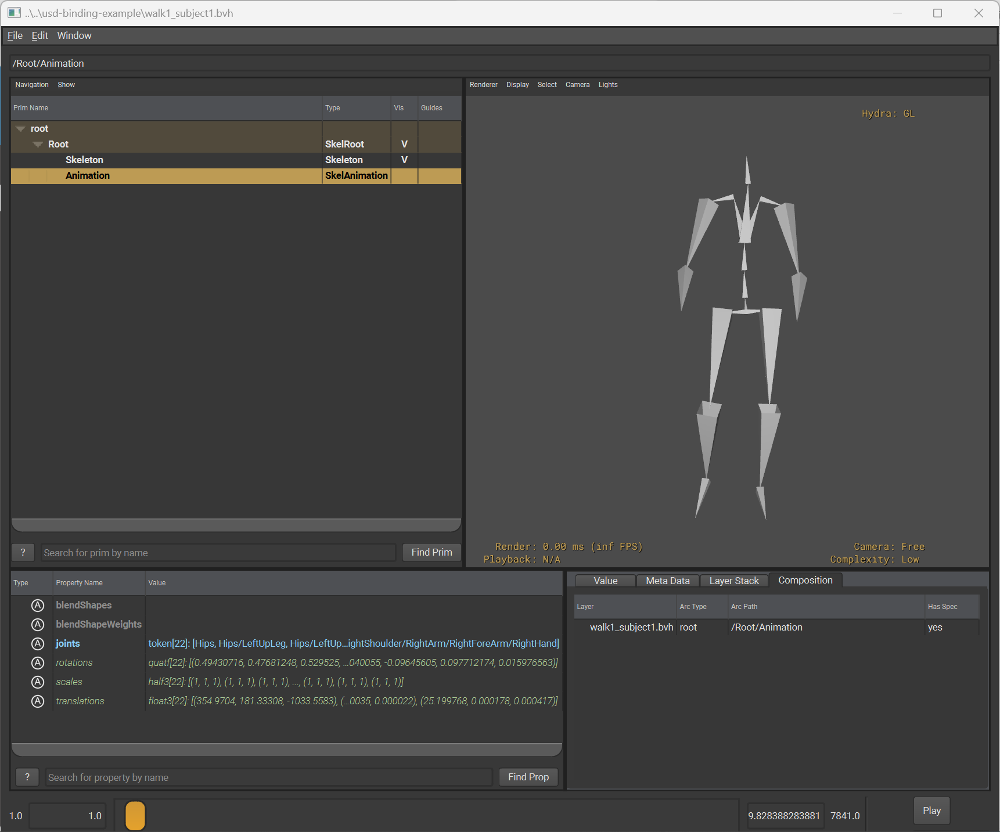
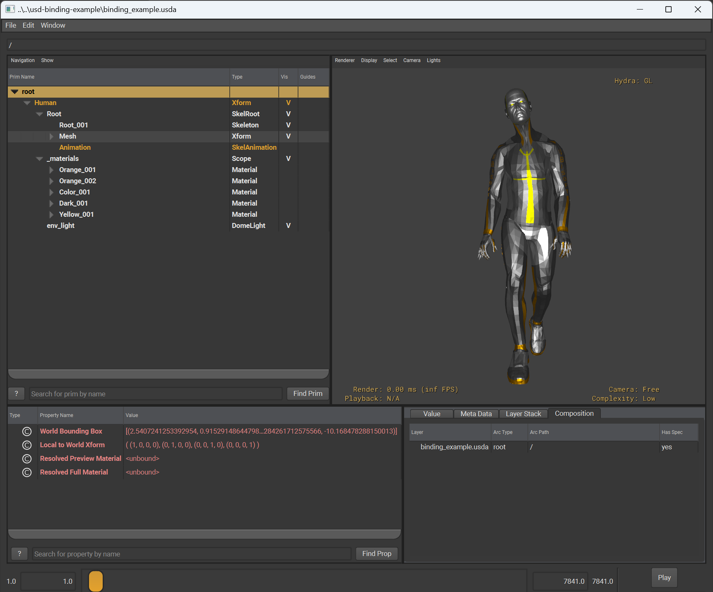

# usdBVHAnim

[](https://github.com/jbrd/usdBVHAnim/actions/workflows/cmake-multi-platform.yml)
| **Version: 1.1.0**
  (**[Changelog](CHANGELOG.md)**)
| **[Documentation](https://jbrd.github.io/usdBVHAnim/)**

This plug-in enables USD to read BVH animation files.



Once installed, USD can either read them directly, e.g.:

`> usdview ./walk_motion.bvh`

Or compose BVH data into a larger scene through its composition arcs, e.g:

```
over "AnimationData"
(
    references = @./walk_motion.bvh@
)
{
}
```


## Example Use Cases

Here are some example use cases that are made possible by the plug-in:

💡Use `usdview` to inspect and play back skeletal animation data in BVH files

💡Use `usdrecord` to render playblasts of BVH motion capture data on the command line

💡Use USD to transcode BVH motion capture data to other file formats

💡Use USD to compose BVH animation into a larger scene composition.

The plug-in supports optional scaling of BVH data so that it can be scaled to conform to the conventions of the stage.

💡Extend a DCC that supports USD (and the usdSkel schema) to import BVH animation data

💡Write your skeletal animation pipeline on top of USD and use this plug-in to ingest BVH data into it

💡Ingest the various open source motion capture data sets delivered in BVH (Ubisoft LAFAN1, etc...) into your USD-based skeletal animation pipeline


To illustrate one such use case, here is a screenshot of the plug-in being used to bind a BVH animation from the
Ubisoft LAFAN1 dataset to its sample model, visualised in usdview.




## Building and Installing

### Version Compatibility Table

First, make sure you are building a version of the plug-in that is compatible with the version of USD you are targetting:

| Plugin Version | USD 24.11 | USD 25.02 | USD 25.05 |
|----------------|-----------|-----------|-----------|
| 1.0.*          | ✅       | ✅       | ✅       |


### Toolchain Requirements

Next, make sure you have the following software installed:

#### Linux and MacOS

* **Required**
  * An OpenUSD Installation (see version compatibility table)
  * CMake
  * GCC or Clang
* Code Formatting (when ``CLANG_FORMAT=on``)
  * Clang
  * Clang-format
* Documentation (when ``DOCUMENTATION=on``)
  * Doxygen
  * Python 3
  * Sphinx (``pip3 install sphinx``)
  * Breathe (``pip3 install breathe``)
  * ReadTheDocs Theme for Sphinx (``pip3 install sphinx-rtd-theme``)
* Testing
  * Valgrind (optional and only when ``VALGRIND=on``)


#### Windows

* **Required**
  * An OpenUSD Installation (see version compatibility table)
  * Visual Studio 2022 with the following components:
    * C++ CMake tools for Windows
* Code Formatting (when ``CLANG_FORMAT=on``)
  * Visual Studio 2022 with the following components:
    * C++ Clang Compiler for Windows (17.0.0 or above)
    * MSBuild support for LLVM (clang-cl) toolset
* Documentation (when ``DOCUMENTATION=on``)
  * Chocolatey and the following packages:
    * Doxygen (``choco install doxygen.install``)
    * Python 3 (``choco install python3``)
    * Sphinx (``pip3 install sphinx``)
    * Breathe (``pip3 install breathe``)
    * ReadTheDocs Theme for Sphinx (``pip3 install sphinx-rtd-theme``)


### Build Instructions

#### Cloning The Repository

This project uses an external build system, so when cloning the repository, make sure you also fetch submodules, e.g.

```
git clone --recurse-submodules https://github.com/jbrd/usdBVHAnim.git
```


#### Build Options

The following options can be specified on the command-line when configuring CMake via the ``-D`` argument:

| Option            | Description                                                                                                | Default Value |
|-------------------|------------------------------------------------------------------------------------------------------------|---------------|
| ``CLANG_FORMAT``  | Include Clang Format targets ``[on/off]``                                                                  | ``on``        |
| ``CXX11_ABI``     | On Linux if linking against libstdc++, explicitly turn CXX11_ABI [on/off]. Uses compiler default if empty. | (empty)       |
| ``DOCUMENTATION`` | Include documentation targets ``[on/off]``                                                                 | ``on``        |
| ``STRICT``        | Strict compilation (all warnings, warnings as errors) ``[on/off]``                                         | ``on``        |
| ``VALGRIND``      | Additionally run unit tests through Valgrind (if installed, Linux only) ``[on/off]``                       | ``on``        |

Contributors are encouraged to install the full set of toolchain requirements, leave all of these turned on by default, such that the entire toolchain is exercised.


#### Build Configurations

To build this plugin, the build configuration you choose must match that of your OpenUSD distro,
otherwise you will get compiler and linker errors.

So, to build this plugin for production environments, against a Release build of OpenUSD, please
use ``--config Release`` (all instructions below will follow this, as its the most common use case).

Likewise, to build this plugin against a Debug build of OpenUSD, please use ``--config Debug``.

#### Building Locally

* On Linux open a bash shell, on Windows open the x64 Native Tools Command Prompt
* Make a build directory and cd into that (e.g. ``mkdir build ; cd build``)
* Generate project files with: ``cmake ../``
* Build the project with: ``cmake --build ./ -- config Release``
* Build the documentation with: ``cmake --build ./ --config Release --target docs``
* Run the tests with: ``ctest -C Release ./``
* Validate source code formatting with: ``cmake --build ./ --target format-check``
* Automatically format source code with: ``cmake --build ./ --target format``

#### Testing Locally

* On Linux open a bash shell, on Windows open the x64 Native Tools Command Prompt
* Make a build directory and cd into that (e.g. ``mkdir build ; cd build``)
* Specify your deployment directory when generating project files: ``cmake -DCMAKE_INSTALL_PREFIX=./deploy ../``
* Install to a local deployment ``cmake --build ./ --target install --config Release``
* Add your local deployment to ``PXR_PLUGINPATH_NAME``, e.g: ``set PXR_PLUGINPATH_NAME=%cd%/deploy/plugin/usd`` on Windows 
* Run ``usdview`` to open a .bvh file

#### Permanently Installing Into an Existing USD Distro

* Make a build directory and cd into it (e.g. ``mkdir build ; cd build``)
* Set your install prefix to the path of your USD distro, e.g. ``cmake -DCMAKE_INSTALL_PREFIX=/opt/usd ../``
* Install with: ``cmake --build ./ --target install --config Release``

Your USD distro should already be set up to read plugins from its ``plugin/usd`` folder, in which case, no
further environment setup is required, and the plug-in will be available whenever you use USD.

#### Permanently Installing Into A Separate Location

* Make a build directory and cd into it (e.g. ``mkdir build ; cd build``)
* Set your install prefix to whatever you like, e.g. ``cmake -DCMAKE_INSTALL_PREFIX=/opt/usdBVHAnim ../``
* Install with: ``cmake --build ./ --target install --config Release``
* Ensure your environment always adds your chosen directory's ``plugin/usd`` folder to ``PXR_PLUGINPATH_NAME``, e.g: ``PXR_PLUGINPATH_NAME=/opt/usdBVHAnim/plugin/usd``

At this point, the plug-in should be available whenever you use USD.


## Contributors

* James Bird (@jbrd)


## License

Copyright 2025 James Bird

Licensed under the Apache License, Version 2.0 (the "License");
you may not use this file except in compliance with the License.
You may obtain a copy of the License at

    http://www.apache.org/licenses/LICENSE-2.0

Unless required by applicable law or agreed to in writing, software
distributed under the License is distributed on an "AS IS" BASIS,
WITHOUT WARRANTIES OR CONDITIONS OF ANY KIND, either express or implied.
See the License for the specific language governing permissions and
limitations under the License.