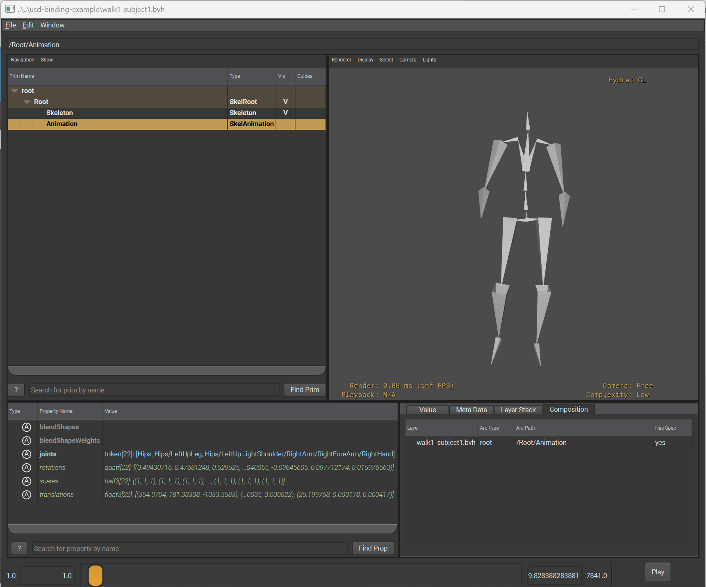
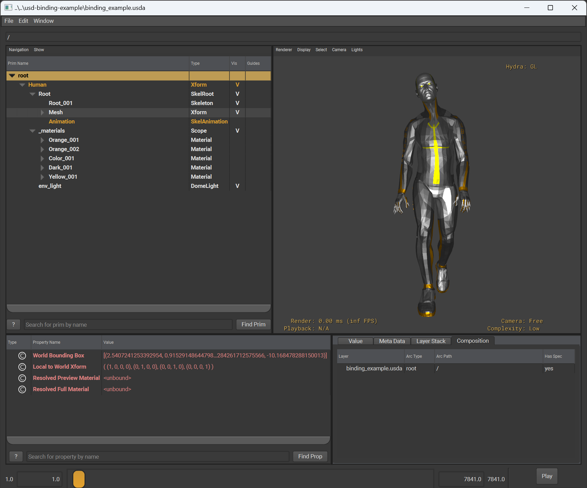

Introduction
============

This plug-in enables USD to read BVH animation files.

Once installed, USD can either read them directly, e.g.:

``> usdview ./walk_motion.bvh``

Or compose BVH data into a larger scene through its composition arcs, e.g:

.. code-block::

    over "Animation"
    (
        references = @./walk_motion.bvh@
    )
    {
    }

In practise, here are some example use cases that are made possible by the plug-in:

* Use `usdview` to inspect and play back skeletal animation data in BVH files
* Use `usdrecord` to render playblasts of BVH motion capture data on the command line
* Use USD to transcode BVH motion capture data to other file formats
* Use USD to compose BVH animation into a larger scene composition
* Extend a DCC that supports USD (and the usdSkel schema) to import BVH animation data
* Write your skeletal animation pipeline on top of USD and use this plug-in to ingest BVH data into it
* Ingest the various open source motion capture data sets delivered in BVH (Ubisoft LAFAN1, etc...) into your USD-based skeletal animation pipeline

To illustrate one such use case, here is a screenshot of the plug-in being used to bind a BVH animation from the
Ubisoft LAFAN1 dataset to its sample model, visualised in usdview.

