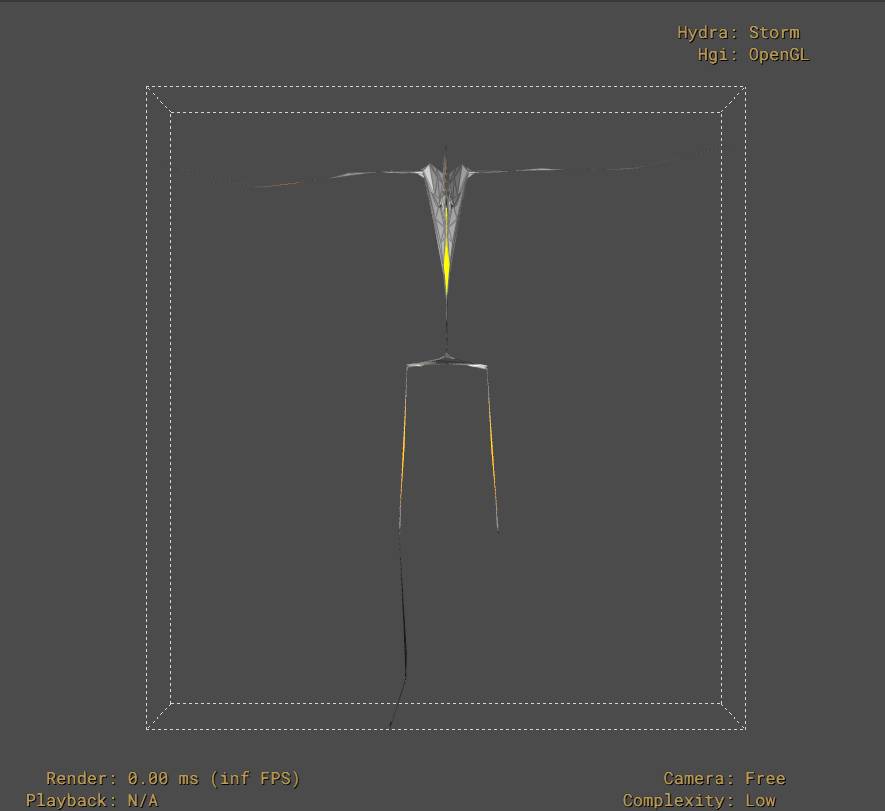
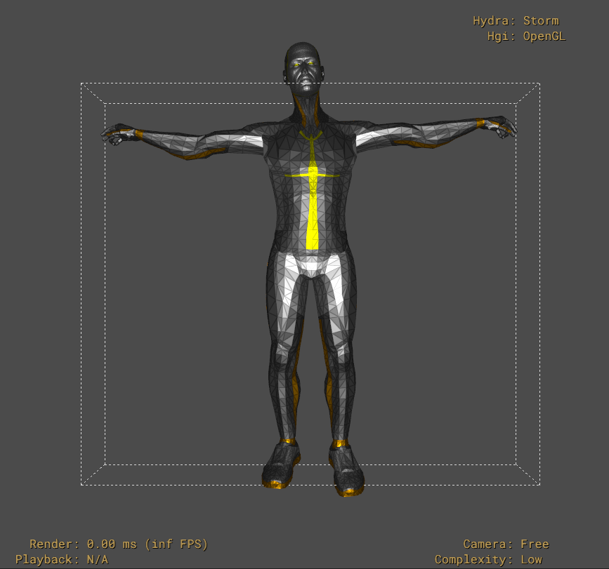

Scaling Animation Data
======================

Overview
--------

The BVH format is unitless, in that it doesn't encode a meters per unit value.
Instead, it is the responsibility of the consumer to understand what units are
represented in the BVH file and scale this when necessary.

A consequence of this is that the plug-in cannot provide root-level ``metersPerUnit`` layer metadata,
nor can it automatically scale the BVH data into some standard unit.

Furthermore, the ``SkelAnimation`` prim is not xformable, and doesn't provide a means of scaling the
animation to conform to the the units of the stage.

These issues motivate an alternative solution for animation scaling.

The scale Argument
------------------

The plug-in can accept an optional file format argument to scale the animation data at import time.

This can be specified when authoring a reference to a BVH file as follows:

.. code-block::

    over "Animation"
    (
        references = @./walk_motion.bvh:SDF_FORMAT_ARGS:scale=0.01@
    )
    {
    }

Here, the ``scale`` argument expects a decimal scaling value. This is applied to the BVH data
before it is translated into prims.

Example
-------

As an example use case, suppose we have a stage that is authored in meters, and contains a
model that we wish to animate with BVH animation. But also suppose the BVH animation data
has been encoded in centimeters.

Without the ``scale`` argument, when applied to the model, the animation will cause the
model to explode, since the translations in the animation are 100 times larger than the
model's skeleton:

We can fix this by using ``scale=0.01`` to scale the animation such that it conforms to the
units of the stage:

